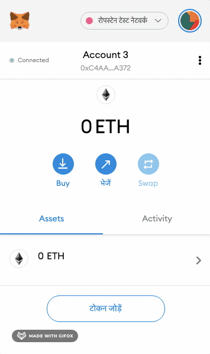
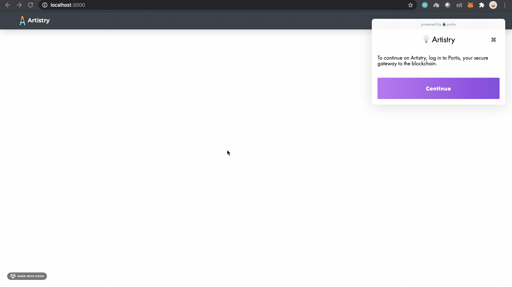
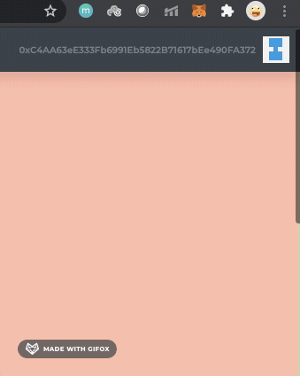

# Artistry

Artistry is an Ethereum based dapp for artists to get tipped for their work
## Installation

Clone the repository's master branch and run

```bash
npm install
```

## Usage

### Testing

Use Ganache to create a local blockchain

Add a couple of test accounts from the local blockchain to MetaMask 

Run 

```
truffle migrate --reset

```

### Portis Integratation with Matic

Clone the matic branch 

```bash

git clone -b matic test https://github.com/ishk23/artistry

```

Add the matic mumbai testnet to metamask if not already added



Run truffle migrate with network as matic

```bash

truffle migrate --network matic

```


Sign in with your Portis account 




Make one click payments to the desired post!



